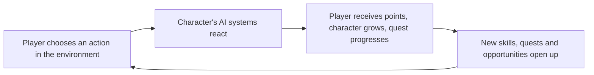

# Game Design Document

# Overview

This document serves as the central reference for Lifelines' design decisions, mechanics, and vision. It consolidates findings from development conversations and establishes the creative and technical direction for the project.

**Last Updated:** January 2026

**Document Status:** Active Development

---

# 1. Core Concept & Vision

## 1.1 High Concept

Lifelines is a **cozy roguelike life-sim** developed in Unreal Engine 5 where the player manages a social housing facility (bolig) with the goal of rehabilitating patients so they can become full members of society. The project explores Nordic storytelling in an interactive setting—rather than trying to make an American or Japanese game, Lifelines aims to create a uniquely Norwegian game inspired by folk tales, Ibsen, and modern works like Skam and Elling.

**The hypothesis:** The key to Norwegian stories with international appeal is their focus on *identity*.

**A roguelike about care work, not combat. About understanding people, not defeating enemies. Very Norwegian. Very Lifelines.**

## 1.2 Genre & Influences

**Primary Genre:** Cozy Roguelike Life-Sim

**Genre Fusion:**

> **Stardew Valley's cozy rhythm** + **Hades' meta-progression** + **The Sims' emergent behavior**
> 

| Element | Implementation |
| --- | --- |
| Each run | A new cohort of 3-5 patients at your social housing |
| Each day | 5-10 minutes (not frantic arcade pacing) |
| Victory | Successfully rehabilitate patients to independence |
| Failure | Forgiving, with meta-unlocks carrying over |

**Narrative Influences:**

- Norwegian folk tales (Askeladden, Veslefrikk) — "Klokskap over kraft" (wisdom over strength)
- Henrik Ibsen's *Et Dukkehjem* — Nora discovers she has only been a doll, first in her father's house, then her husband's
- *Elling* (2001) — Learning ordinary things is the victory; the hero is arguably the welfare system
- *Skam* (2015) — Realistic focus on identity for high school students; existential realism

## 1.3 The Norwegian Storytelling Difference

| American (Hero's Journey) | Japanese (Purification) | Norwegian (Identity/Competence) |
| --- | --- | --- |
| Weak → Strong | Corrupt → Pure | Lost → Found |
| Power fantasy | Cleanse corruption | Realistic competence |
| Individual destiny | Restore nature's order | Integration with society |
| Combat mastery | Environmental puzzles | Skill mastery |
| Save the world | Purify the world | Understand yourself |

**Key insight:** What is Act 1 in American storytelling (discovering identity, like Luke learning about his Jedi heritage) is Act 3 in Norwegian storytelling.

## 1.4 Unique Selling Points

- Nordic storytelling in an interactive setting—not trying to copy American or Japanese games
- Focus on identity as the key to international appeal
- Victory isn't heroic—it's watching someone finally answer the phone
- Characters learn realistic life skills, not superpowers
- The welfare system as a potential "hero" of the narrative
- You can't save everyone (Norwegian realism vs American heroism)

## 1.5 Target Audience

- [To be filled: Demographics, player types, comparable game audiences]

## 1.6 Design Pillars

**Pillar 1: Empathetic Curiosity (Empatisk nysgjerrighet)**

Each character's personality emerges from simple systems that the player can explore, creating thought-provoking curiosity.

**Pillar 2: Satisfying Growth (Tilfredsstillende vekst)**

The game has an artistic style, colors, and systems that are both cozy and satisfying to watch. The player experiences mastery and joy from seeing characters and numbers grow.

**Pillar 3: Humorous Contrast (Humoristisk kontrast)**

Humor is never far away, creating lightness between the emotional moments.

## 1.7 Design Principles

| Principle | Implementation |
| --- | --- |
| Simple input, complex simulation | Player schedules activities; system runs 50 hidden calculations |
| Show, don't tell | No stats on screen; watch behavior change |
| Emergent relationships | Friendships form from shared time, not buttons |
| Cozy progression | Satisfying visual feedback, streak mechanics |
| You can't save everyone | Norwegian realism vs American heroism |
| Klokskap over kraft | Clever diagnosis beats brute force |
| System as hero | Welfare enables recovery, not individual saviors |

## 1.8 Core Fantasy

> "The player experiences satisfying growth by helping patients develop missing life skills—the victory isn't heroic, it's watching someone finally answer the phone."
> 

---

# 2. Gameplay Mechanics

## 2.1 Core Loop



## 2.2 Game Flow

The game starts with micromanagement and failures. As characters learn skills, they become more independent. They also produce abstract resources. Each character has a different personality—you know them by the types and amounts of resources they generate in response to their actions.

**Meta-cognitive choices:** Now that you *can* do things, what do you *value* doing?

## 2.3 The Overskudd System (Central Resource)

**"Overskudd"** (Norwegian for "surplus/capacity") is the *only* visible resource. Everything else is hidden.

### How It Works:

- Depletes when doing activities
- Regenerates based on hidden stats (nutrition, security, sleep quality)
- When low: patients refuse activities, make mistakes, can spiral

### Core Formula:

```
Regen Rate = Base Rate × Nutrition Modifier × Energy Modifier × Security Modifier
```

This creates the core tension: **managing invisible complexity through observable behavior.**

## 2.4 Hidden Stats → Observable Behavior

**Player sees:** Characters doing activities, mood changes (emoji only), friendships forming

**System tracks:** 50+ hidden variables driving emergent behavior

### Key Hidden Stats:

| Stat | Description | Revealed By |
| --- | --- | --- |
| Purpose | Why bother doing anything? | Therapy Session |
| Security | Am I safe here? | Social Worker Interview |
| Attention/Focus | Can I concentrate? | Psych Evaluation |
| Social Battery | Drained by interaction | Observation |
| Energy | Physical stamina | Medical Checkup |
| Nutrition | Affects overskudd regen | Medical Checkup |

### Big 5 Personality Traits (affect activity preferences):

- Openness
- Conscientiousness
- Extraversion
- Agreeableness
- Neuroticism

**The player discovers patterns:** "Elling always reads alone after group activities" emerges from the system—you're never told this directly.

## 2.5 Diagnostic Discovery System

Patients arrive as mysteries. You must **diagnose** to reveal hidden stats.

### Diagnostic Activities:

| Diagnostic | Reveals | Cost |
| --- | --- | --- |
| Therapy Session | Purpose | Time + Money |
| Medical Checkup | Nutrition, Energy | Money |
| Psych Evaluation | Attention, Working Memory | Time + Money |
| Social Worker Interview | Security, Trauma triggers | Time |
| Aptitude Test | Flow activities | Time |

### Key Mechanics:

- Diagnosis costs resources
- Patients can refuse (low overskudd = won't go to therapy)
- Creates chicken-egg problems that require clever solutions
- Mechanizes the Norwegian identity journey through gradual discovery

## 2.6 Player Actions

- Schedule activities for patients
- Assign diagnostic evaluations
- Unlock and place facility upgrades
- Observe and learn patient patterns
- Guide (but not control) patient choices

## 2.7 Character Attribute System

→ See: [Vocational Resource Skill System](https://www.notion.so/Vocational-Resource-Skill-System-1-2f3a7d4d678e801d88daef76822a0608?pvs=21) for full details

### 2.7.1 Core Mental Attributes (Trainable, 0-100 scale)

**Cognitive Capacity:**

- `attention_span` — Duration character can focus on single task
- `processing_speed` — Rate of information absorption
- `working_memory` — Information held simultaneously
- `mental_stamina` — Resistance to cognitive fatigue

**Thinking Styles:**

- `divergent_thinking` — Generate multiple solutions
- `convergent_thinking` — Narrow to optimal solution
- `abstract_reasoning` — Working with concepts
- `spatial_reasoning` — Mental manipulation of physical forms

### 2.7.2 Personality Traits (Semi-fixed, 0.0-1.0 scale)

- `conscientiousness` — Organization, reliability, detail
- `openness` — Curiosity, novelty-seeking, imagination
- `emotional_stability` — Stress resilience, consistency
- `sociability` — Energy from social interaction
- `assertiveness` — Leadership, confidence
- `adaptability` — Comfort with change

### 2.7.3 Interests/Affinities (Fixed, 0.0-1.0 scale)

**Subject Domains:** science, art, nature, people, systems, philosophy, craft, technology

**Work Styles:** solo_work_preference, structure_preference, theory_practice_balance, detail_bigpicture_focus

## 2.8 Hierarchical Skill System (Piaget-Inspired)

→ See: [Vocational Resource Skill System](https://www.notion.so/Vocational-Resource-Skill-System-1-2f3a7d4d678e801d88daef76822a0608?pvs=21) for full specification

Skills are organized in developmental tiers where higher-order thinking emerges from mastery of foundational capabilities.

### Tier Structure

| Tier | Name | Age Equivalent | Required Foundation |
| --- | --- | --- | --- |
| 0 | Sensorimotor | Birth-2 years | Automatic (pre-game) |
| 1 | Preoperational | 2-7 years | Can begin immediately |
| 2 | Concrete Operational | 7-11 years | Tier 1 skills at level 3+ |
| 3 | Formal Operational | 11+ years | Tier 2 skills at level 5+ |
| 4 | Post-Formal (Mastery) | Adult expertise | Tier 3 skills at level 7+ |

### Skill Categories

- **Analytical:** logic, mathematics, pattern_recognition, critical_thinking, data_analysis
- **Creative:** artistic_expression, narrative_design, musical_ability, imaginative_synthesis, aesthetic_judgment
- **Technical:** tool_mastery, precision_work, system_operation, troubleshooting, craftsmanship
- **Social:** communication, empathy, persuasion, collaboration, leadership, negotiation
- **Physical:** dexterity, endurance, strength, agility
- **Organizational:** planning, resource_management, time_management, documentation, delegation

### Key Learning Mechanics

- **Foundation Bonus:** Strong prerequisites = faster learning (up to 2-3x speed)
- **Skill Synergy:** Related skills boost each other's effectiveness
- **Critical Periods:** Some skills have optimal learning windows
- **Skill Transfer:** Related experience makes new skills easier
- **Skill Decay:** Unused skills decay, but relearning is faster than initial learning
- **Crystallization:** Skills at level 8+ become resistant to decay

### XP Progression

| Level | Title | XP Required |
| --- | --- | --- |
| 0 | Untrained | 0 |
| 1 | Novice | 100 |
| 2 | Beginner | 250 |
| 3 | Competent | 500 |
| 4 | Proficient | 1,000 |
| 5 | Skilled | 2,000 |
| 6 | Expert | 4,000 |
| 7 | Master | 7,000 |
| 8 | Grandmaster | 11,000 |
| 9 | Legendary | 16,000 |
| 10 | Transcendent | 22,000 |

**Time Investment:** Level 5 ≈ 50-100 hours, Level 10 ≈ 500-1000 hours

## 2.9 Quest System

Quests are the only numbers players see:

> **"Get 300 Creativity"** — Progress: 45/300
> 

Behind the scenes, activities contribute creativity based on dozens of hidden calculations. Player just watches and guides.

### Quest Structure:

```tsx
Quest {
  character: ACharacter;
  title: string;
  description: string;
  
  requirements: {
    [resource: string]: {
      current: number;
      target: number;
    }
  };
  
  unlocks: {
    activities: Activity[];
    areas: string[];
    story: string;
  };
}
```

## 2.10 Emergent Relationship System

No "befriend" button. Friendships form organically.

### How Relationships Grow:

1. Shared activities → familiarity grows
2. Both happy during activity → positive interactions++
3. Shared interests discovered → relationship modifiers improve
4. Eventually, characters **choose** to do activities together autonomously

### Relationship Effects:

- Activity preference boost (want to do things together)
- Mood boost (happier when near each other)
- Support bonus (help each other succeed)

## 2.11 Needs System

- Eating
- Sleeping
- Bathroom
- Energy
- Social
- Cooking

## 2.12 Vocation/Job System

Jobs reference the hierarchical skill system. The system automatically validates that characters have foundational skills needed.

**Example Job: Senior Researcher**

- Required skills: research_methodology (6), data_analysis (7), critical_thinking (6), documentation (5)
- Produces: research, knowledge, truth, insight

## 2.13 Resource System

→ See: [Vocational Resource Skill System](https://www.notion.so/Vocational-Resource-Skill-System-1-2f3a7d4d678e801d88daef76822a0608?pvs=21) for full details

### Cognitive Resources

knowledge, information, truth, ideas, insight, wisdom, research, innovation

### Creative Resources

beauty, vision, wonder

### Social Resources

influence, trust, connection, reputation, authority

### Productive Resources

plans, order, refinement, momentum, infrastructure, material_resources, wealth

### Other Resources

destruction, clarity, purpose, mastery, legacy, focus

---

# 3. Characters & Archetypes

## 3.1 Patient Archetypes

8-10 base archetypes that combine into hundreds of procedural variations:

| Archetype | Profile | Challenge |
| --- | --- | --- |
| **The Withdrawn** | Low purpose, low social battery | Depression patterns |
| **The Restless** | High motivation, low attention | ADHD patterns |
| **The Anxious** | Low security, high vigilance | Anxiety patterns |
| **The Skeptic** | Refuses diagnosis, high will | Trust must be earned |
| **The Addict** | Cycling stats, external dependencies | Withdrawal cycles |
| **The Overwhelmed** | Low overskudd regen | Complex trauma |
| **The Capable** | High stats, one critical flaw | Hidden vulnerability |
| **The Elder** | Different needs | Wisdom to share |

## 3.2 Procedural Modifiers

- Hidden conditions (revealed through diagnosis)
- Flow activity preferences (unique to individual)
- Trauma triggers (certain activities cause stat drops)
- Relationship dynamics (with other patients)

## 3.3 Personality System

- Unique personalities per character generated from attribute combinations
- Interest areas and themes
- Characters known by the types and amounts of resources they generate

## 3.4 Example Character Pathways

**The Scientist:** observation → pattern_recognition → mathematics → data_analysis → research_methodology

**The Artist:** observation → artistic_observation → imaginative_play → artistic_expression → artistic_mastery

**The Leader:** verbal_expression → empathy → communication → persuasion → leadership → organizational_leadership

**The Engineer:** fine_motor_control → spatial_reasoning → craftsmanship → engineering → technical_mastery

**The Renaissance Person:** Broad foundation → diverse Tier 2-3 skills → interdisciplinary_synthesis → wisdom

---

# 4. Run Structure & Progression

## 4.1 Run Structure (12-Week Cohort)

### Week 1: Intake

- Patients arrive with minimal info
- Observe behaviors
- Initial activity attempts reveal clues
- Choose who to diagnose first (limited resources)

### Weeks 2-4: Discovery & Crisis

- Diagnosis reveals hidden conditions
- Skills training begins
- Random events challenge stability
- Patients may refuse help (need to build trust)

### Weeks 5-8: Stabilization

- Routines established
- Purpose-building activities
- Preparing for independence
- Some patients ready to "graduate"

### Weeks 8-12: Graduation or Relapse

- **Success:** Patient stable enough for independent living
- **Partial:** Patient improved but needs continued support
- **Failure:** Patient relapses, leaves, or dies

## 4.2 Key Design Decisions

| Question | Decision | Rationale |
| --- | --- | --- |
| Failure punishment? | Forgiving with meta-unlocks | Like Hades, not Slay the Spire |
| Patients between runs? | Clean slate, but same patients can appear | You "know" them now |
| Permadeath? | **Yes, patients can die** | Harsh realism, very Norwegian |
| Player progression? | Unlock tools, skills, upgrades | Like deckbuilder unlocks |

## 4.3 Meta-Progression System

### Diagnostic Tools (Unlockable):

- 🔓 Basic Therapy (reveals Purpose)
- 🔓 Advanced Psych Eval (reveals Attention + Working Memory)
- 🔓 Trauma Assessment (reveals Security + triggers)
- 🔓 Aptitude Testing (reveals Flow activities)
- 🔓 Group Therapy (reveals relationship dynamics)

### Intervention Skills (Unlockable):

- 🔓 CBT Techniques (reduce anxiety drain)
- 🔓 Vocational Training (teach job skills faster)
- 🔓 Nutrition Program (improve meal planning)
- 🔓 Peer Support (patients help each other)
- 🔓 Crisis Intervention (emergency overskudd restoration)

### Facility Upgrades (Unlockable):

- 🔓 Workshop (carpentry flow activities)
- 🔓 Garden (nature-based recovery)
- 🔓 Library (reading-based recovery)
- 🔓 Kitchen (cooking skills training)
- 🔓 Quiet Room (faster social battery recovery)

## 4.4 Character Growth Phases

Based on the Piaget-inspired skill system:

**Early Game (0-100 hours):**

- Building foundations across multiple Tier 1-2 skills
- Experimenting with different paths
- Simple jobs available
- Fast visible progress

**Mid Game (100-500 hours):**

- Specializing in Tier 2-3 skills
- Foundation choices become consequential
- Complex jobs unlock
- Character identity emerges

**Late Game (500+ hours):**

- Mastering Tier 3-4 skills
- Teaching others (using mentorship skill)
- Legacy building
- Rare "renaissance person" builds possible

## 4.5 Teaching & Mentorship

Teaching creates cascading benefits:

- Student learns (effectiveness based on teacher's skill + teaching ability)
- Teacher gains teaching skill XP
- Teacher deepens own understanding (explaining = learning)
- Both gain wisdom and insight resources
- Builds connection between teacher and student

**Late-game mechanic:** Players can create educational institutions (academies) that generate knowledge as a byproduct of teaching.

---

# 5. Story & World

## 5.1 Setting

- **Location:** Norway
- **Time Period:** [To be filled]
- **Environment:** Social housing facility / rehabilitation institution

## 5.2 Premise

The player runs a social housing facility with the goal of rehabilitating patients so they can become full members of society.

## 5.3 Narrative Themes

- **Identity and self-discovery** — The core Norwegian storytelling tradition
- **Lost → Found** — Not weak→strong, but lost→found
- **Rehabilitation and growth** — Learning to do ordinary things
- **Integration with society** — Not individual destiny, but becoming part of something larger
- **Realistic competence over power fantasy** — Skill mastery, not combat mastery
- **System as hero** — The welfare system enables recovery, not individual saviors

## 5.4 Narrative Moments

**Example: "The Nora Moment" (Et Dukkehjem)**

- Player has mastered household management
- Dialogue reveals they're doing it all for others' expectations
- **Choice point:** Continue optimizing *their* life, or redesign around *your* values?
- Mechanical consequence: Same tasks, different meaning/efficiency based on motivation

---

# 6. Technical & Scope

## 6.1 Platform & Technology

- **Engine:** Unreal Engine 5
- **Language:** C++
- **Target Platforms:** [To be filled]

## 6.2 Team

- **Developer:** Terje (solo developer)
- **Timeline:** September 2025 - August 2026 (1 year)

## 6.3 Art Direction

- [To be filled: Visual style, references, mood]

## 6.4 Audio Direction

- [To be filled: Music style, sound design approach]

## 6.5 Feature Priorities

### Must Have (First Demo)

- Quest/progression system
- Primary needs (Eat, Sleep, Bathroom, Energy, Social, Cook)
- Jobs (get or perform)
- Crafting
- Skill training
- Character interest areas/themes
- Unique personalities
- Talent trees

### Should Have (Release)

- Multiple institutions with upgrades
- Recovery and moving out
- Treatment institution with upgrades
- Emotional range (anger, joy, shame, nervousness, mastery, empathy)
- Additional locations (e.g., store)
- Relationships (love, intimacy, conflict)
- External characters/visitors
- Privileges and punishments system
- Multiple patients
- Dialogue (text or voice)
- Social system / friendships
- Item/furniture upgrades
- Death/suicide mechanics

### Could Have

- Cinematics
- House building
- Character backstories
- Character mentors
- Characters helping other characters
- Service professions

## 6.6 Development Roadmap

### Month 1-3: Core Systems

- Overskudd resource system with hidden stat modifiers
- Basic activity framework (10-15 activities)
- 3 patient archetypes with distinct behaviors
- Simple run structure (8-week cohort)

### Month 4-6: Roguelike Layer

- Meta-progression unlocks
- Event system
- Procedural patient generation
- Victory/failure conditions

### Month 7-9: Content & Polish

- 8-10 archetypes total
- 20+ activities
- 30+ events
- UI/UX polish
- Animation & behavior system

### Month 10-12: Balance & Juice

- Playtesting & tuning
- Audio design
- Visual polish
- Story mode (if time permits)
- Marketing prep

---

# 7. References & Research

→ See: [References page](https://www.notion.so/References-2f3a7d4d678e806f83fdf51181c21788?pvs=21)

## 7.1 Game References

- Stardew Valley (cozy rhythm)
- Hades (meta-progression, forgiving failure)
- The Sims (emergent behavior)
- Balatro (creating a “machine” that spits out big numbers)
- Punch Club (simple day management/simulation system)

## 7.2 Narrative References

- Norwegian folk tales (Askeladden, Veslefrikk)
- Henrik Ibsen (*Et Dukkehjem*)
- *Skam* (TV series, 2015)
- *Elling* (film, 2001)

## 7.3 Design Research

- Piaget's cognitive development stages (basis for skill tier system)
- [To be filled: Additional articles, GDC talks, books consulted]

---

# 8. Detailed System Documentation

## 8.1 Full Skill System Specification

→ [Vocational Resource Skill System](https://www.notion.so/Vocational-Resource-Skill-System-1-2f3a7d4d678e801d88daef76822a0608?pvs=21)

Contains:

- Complete skill tree (60+ skills across 4 tiers)
- Learning rate calculations with code examples
- Foundation bonus formulas
- Skill synergy system
- Critical periods and age factors
- Skill decay and maintenance
- Teaching and mentorship mechanics
- Job performance calculations
- Breakthrough moments
- Skill combinations and special abilities

## 8.2 System Visualizations

→ [Mermaid Chart Tests](https://www.notion.so/Mermaid-chart-tests-2f3a7d4d678e806b87a3c83726fdc0aa?pvs=21)

Contains flowcharts for:

- Core Mental Attributes
- Personality Traits (Big Five Extended)
- Skill Categories
- Interests & Affinities
- Skill Progression (XP thresholds)
- Job Performance Calculation

## 8.3 Background Research

→ [Bakgrunn](https://www.notion.so/Bakgrunn-2f3a7d4d678e80bb9300e809c94def2b?pvs=21)

Contains:

- Analysis of Norwegian storytelling vs American/Japanese
- Narrative references and their themes

---

# Appendices

## A. Glossary

- **Overskudd** — Norwegian for "surplus/capacity"; the only visible resource in the game
- **Tier** — Skill development level based on Piaget's cognitive stages
- **Foundation Bonus** — Learning speed multiplier from strong prerequisites
- **Crystallization** — When a skill at level 8+ becomes resistant to decay
- **Renaissance Person** — Character build with broad skills enabling interdisciplinary_synthesis
- **Flow activity** — Activity that matches a character's hidden preferences
- **Klokskap over kraft** — "Wisdom over strength"; Norwegian design principle

## B. Change Log

| Date | Section | Changes |
| --- | --- | --- |
| Jan 2026 | All | Initial skeleton created |
| Jan 2026 | 1, 2, 3, 6 | Added content from Bakgrunn, Vocational Resource Skill System, and Mermaid charts |
| Jan 2026 | All | Major update: Added genre definition, Overskudd system, patient archetypes, diagnostic system, run structure, meta-progression, development roadmap from design conversations |